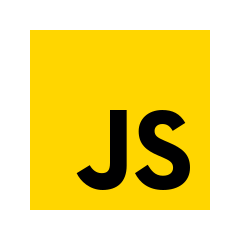
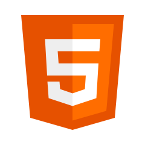
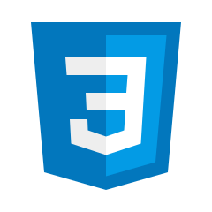
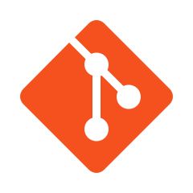

# 3D Portfolio

A modern, responsive, and interactive personal portfolio built with React, Vite, Tailwind CSS, and Three.js.

**Live Demo:** https://portfolio-eight-eta-rsxbqfkpoq.vercel.app/

This project showcases profile information, experience, projects, certificates, and technical skills with animated UI sections and 3D canvas components.

## Overview

The portfolio is designed to be:

- Fast to load and easy to customize.
- Mobile-friendly and responsive across breakpoints.
- Visually engaging with 3D elements and motion effects.
- Data-driven from a single constants file for easy content updates.

## Features

- Hero section with interactive 3D model.
- Animated sections for About, Experience, Tech, Projects, and Contact.
- Skills/stack display with icon-based visuals.
- Certificates and internship highlights.
- Social links and downloadable resume.
- Responsive layout optimized for desktop and mobile.

## Tech Stack (With Images)

### Core

| Technology | Icon |
| --- | --- |
| React |  |
| JavaScript |  |
| HTML5 |  |
| CSS3 |  |
| Vite |  |

### 3D / Motion

- Three.js
- @react-three/fiber
- @react-three/drei
- Framer Motion

### Styling

- Tailwind CSS
- PostCSS

### Additional Stack Icons

| Technology | Icon |
| --- | --- |
| Java |  |
| MySQL |  |
| Git |  |
| Next.js |  |

## Project Structure

```text
src/
	assets/         # Images, icons, logos, project graphics
	components/     # UI sections and canvas components
	constants/      # Portfolio content and configuration
	hoc/            # Higher-order components
	utils/          # Animation and helper utilities
```

## Getting Started

### Prerequisites

- Node.js 18+
- npm 9+

### Installation

```bash
npm install
```

### Run Development Server

```bash
npm run dev
```

### Build for Production

```bash
npm run build
```

### Preview Production Build

```bash
npm run preview
```

## Customization

Most site content is managed in:

- `src/constants/index.js`

Update this file to change:

- Personal details
- Navigation links
- Skills and technologies
- Experience timeline
- Project cards
- Social links and resume URL

## Scripts

| Command | Description |
| --- | --- |
| `npm run dev` | Start local dev server |
| `npm run build` | Create production build |
| `npm run preview` | Preview build locally |

## Deployment

This Vite project can be deployed to platforms like:

- Netlify
- Vercel
- GitHub Pages
- Any static hosting provider

Build output is generated in the `dist/` directory.

## License

This project is available for personal and educational use. Add a dedicated license file if you plan to distribute or publish commercially.
# Portfolio